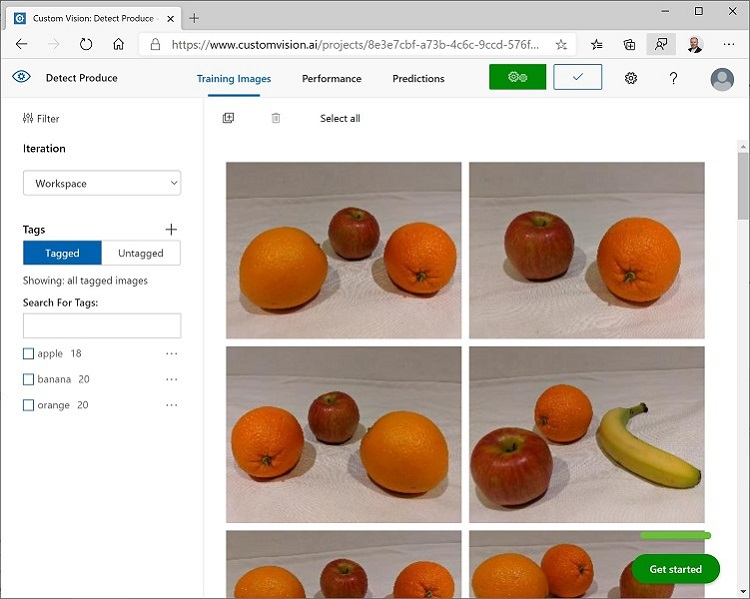

---
lab:
  title: Rilevare oggetti nelle immagini con Visione personalizzata di Azure AI
---

# Rilevare oggetti nelle immagini con Visione personalizzata di Azure AI

In questo esercizio si userà il servizio Visione personalizzata per eseguire il training di un modello di *rilevamento oggetti* in grado di rilevare e individuare tre classi di frutti (mela, banana e arancia) in un'immagine.

## Clonare il repository per questo corso

Se è già stato clonato il repository di codice **mslearn-ai-vision** nell'ambiente in cui si sta lavorando a questo lab, aprirlo in Visual Studio Code. In caso contrario, seguire questa procedura per clonarlo ora.

1. Avviare Visual Studio Code.
2. Aprire il riquadro comandi (MAIUSC+CTRL+P) ed eseguire un comando **Git: Clone** per clonare il repository `https://github.com/MicrosoftLearning/mslearn-ai-vision` in una cartella locale. Non è importante usare una cartella specifica.
3. Dopo la clonazione del repository, aprire la cartella in Visual Studio Code.
4. Attendere il completamento dell'installazione di file aggiuntivi per supportare i progetti in codice C# nel repository.

    > **Nota**: se viene richiesto di aggiungere gli asset necessari per la compilazione e il debug, selezionare **Non adesso**.

## Creare risorse di Visione personalizzata

Se nella sottoscrizione di Azure sono già disponibili risorse di **Visione personalizzata** per il training e la previsione, in questo esercizio è possibile usare tali risorse o un account multiservizio esistente. In caso contrario, usare le istruzioni seguenti per crearle.

> **Nota**: se si usa un account multiservizio, la chiave e l'endpoint saranno uguali sia per il training che per la previsione.

1. In una nuova scheda del browser aprire il portale di Azure all'indirizzo `https://portal.azure.com` ed eseguire l'accesso usando l'account Microsoft associato alla sottoscrizione di Azure.
2. Selezionare il pulsante **&#65291;Crea una risorsa**, cercare *visione personalizzata* e creare una risorsa di **Visione personalizzata** con le impostazioni seguenti:
    - **Opzioni di creazione**: Entrambi
    - **Sottoscrizione**: *la sottoscrizione di Azure usata*
    - **Gruppo di risorse**: *scegliere o creare un gruppo di risorse. Se si usa una sottoscrizione con restrizioni, si potrebbe non essere autorizzati a creare un nuovo gruppo di risorse. Usare quello fornito*
    - **Area**: *scegliere una qualsiasi area disponibile*
    - **Nome**: *immettere un nome univoco*
    - **Piano tariffario per il training**: F0
    - **Piano tariffario previsione**: F0

    > **Nota**: se è già disponibile un servizio di visione personalizzata F0 nella sottoscrizione in uso, selezionare **S0**.

3. Attendere la creazione delle risorse e quindi visualizzare i dettagli di distribuzione e osservare che è stato effettuato il provisioning di due risorse di Visione personalizzata: una per il training e un'altra per la stima (suffisso **-Prediction**). È possibile visualizzarle accedendo al gruppo di risorse in cui sono state create.

> **Importante**: per ogni risorsa sono disponibili un *endpoint* e *chiavi* specifiche, che vengono usati per gestire l'accesso dal codice. Per eseguire il training di un modello di classificazione immagini, il codice deve usare la risorsa di *training* (con l'endpoint e la chiave corrispondenti). Per usare il modello con training per prevedere le classi di immagini, il codice deve usare la risorsa di *previsione* (con l'endpoint e la chiave corrispondenti).

## Creare un progetto di Visione personalizzata

Per eseguire il training di un modello di rilevamento oggetti, è necessario creare un progetto Visione personalizzata basato sulla risorsa di training. A questo scopo, si userà il portale di Visione personalizzata.

1. In una nuova scheda del browser aprire il portale di Visione personalizzata all'indirizzo `https://customvision.ai` ed eseguire l'accesso usando l'account Microsoft associato alla sottoscrizione di Azure.
2. Creare un nuovo progetto con le seguenti impostazioni:
    - **Nome**: Detect Fruit
    - **Descrizione**: Object detection for fruit.
    - **Risorsa**: *la risorsa di Visione personalizzata creata in precedenza*
    - **Tipi di progetto**: Rilevamento oggetti
    - **Domini**: Generale
3. Attendere che il progetto venga creato e aperto nel browser.

## Aggiungere e contrassegnare le immagini

Per eseguire il training di un modello di rilevamento oggetti, è necessario caricare immagini contenenti le classi che si desidera far identificare al modello e contrassegnarle per indicare i rettangoli delimitatori per ogni istanza dell'oggetto.

1. In Visual Studio Code visualizzare le immagini di training nella cartella **03-object-detection/training-images** in cui è stato clonato il repository. Questa cartella contiene immagini di frutta.
2. Nel portale Visione personalizzata, nel tuo progetto di rilevamento degli oggetti, seleziona **Aggiungi immagini** e carica tutte le immagini della cartella estratta.
3. Dopo aver caricato le immagini, selezionare la prima per aprirla.
4. Posizionare il mouse su qualsiasi oggetto nell'immagine fino a quando viene visualizzata un'area rilevata automaticamente come nell'immagine seguente. Quindi selezionare l'oggetto e, se necessario, ridimensionare l'area per circondarlo.

    

    In alternativa, è possibile trascinare semplicemente il mouse intorno all'oggetto per creare un'area.

5. Quando l'area circonda l'oggetto, aggiungere un nuovo tag con il tipo di oggetto appropriato (*apple*, *banana* o *orange*) come mostrato di seguito:

    

6. Selezionare ogni altro oggetto nell'immagine e aggiungere i tag, ridimensionando le aree e aggiungendo nuovi tag come necessario.

    

7. Usare il collegamento **>** sulla destra per passare all'immagine successiva e aggiungere un tag ai relativi oggetti. Continuare così per tutta la raccolta di immagini, aggiungendo un tag a ogni mela, banana e arancia.

8. Al termine dell'assegnazione di tag all'ultima immagine, chiudere l'editor **Dettaglio immagine**. Nella pagina **Immagini di training**, in **Tag** selezionare **Contrassegnate** per visualizzare tutte le immagini con tag:



## Usare l'API Training per caricare le immagini

È possibile usare l'interfaccia utente nel portale di Visione personalizzata per assegnare un tag alle immagini, ma molti team di sviluppo per intelligenza artificiale usano altri strumenti che generano file contenenti informazioni sui tag e sulle aree oggetto nelle immagini. In scenari come questo è possibile usare l'API Training di Visione personalizzata per caricare immagini con tag nel progetto.

> **Nota**: in questo esercizio è possibile scegliere se usare l'API dall'SDK **C#** o **Python**. Nella procedura seguente eseguire le azioni appropriate per il linguaggio scelto.

1. Fare clic sull'icona delle *impostazioni* (&#9881;) in alto a destra nella pagina **Immagini training** nel portale di Visione personalizzata per visualizzare le impostazioni del progetto.
2. In **Generale** (sulla sinistra) prendere nota del valore di **ID progetto** che identifica in modo univoco questo progetto.
3. A destra, in **Risorse** osservare la chiave e l'endpoint. Questi dati sono relativi alla risorsa di *training*. È anche possibile ottenere queste informazioni visualizzando la risorsa nel portale di Azure.
4. Nella cartella **03-object-detection** in Visual Studio Code espandere la cartella **C-Sharp** o **Python** in base al linguaggio scelto.
5. Fare clic con il pulsante destro del mouse sulla cartella **train-detector** e aprire un terminale integrato. Installare quindi il pacchetto Training di Visione personalizzata eseguendo il comando appropriato per il linguaggio scelto:

**C#**

```
dotnet add package Microsoft.Azure.CognitiveServices.Vision.CustomVision.Training --version 2.0.0
```

**Python**

```
pip install azure-cognitiveservices-vision-customvision==3.1.1
```

6. Visualizzare i contenuti della cartella **train-detector** e notare che include un file per le impostazioni di configurazione:
    - **C#**: appsettings.json
    - **Python**: .env

    Aprire il file di configurazione e aggiornare i valori di configurazione in esso contenuti in modo che corrispondano all'endpoint e alla chiave per la risorsa di *training* di Visione personalizzata e all'ID del progetto di rilevamento oggetti creato in precedenza. Salva le modifiche.

7. Nella cartella **train-detector** aprire **tagged-images.json** ed esaminare il codice JSON in esso contenuto. Il codice JSON definisce un elenco di immagini, ognuna delle quali contiene una o più aree con tag. Ogni area con tag include un nome di tag e le coordinate top e left, nonché le dimensioni di larghezza e altezza del rettangolo delimitatore contenente l'oggetto con tag.

    > **Nota**: le coordinate e le dimensioni in questo file indicano punti relativi nell'immagine. Ad esempio, un valore *height* pari a 0.7 si riferisce a un rettangolo delimitatore che rappresenta il 70% dell'altezza dell'immagine. Con alcuni strumenti per l'assegnazione di tag vengono generati altri formati di file in cui i valori di coordinate e dimensioni rappresentano pixel, pollici o altre unità di misura.

8. Si noti che la cartella **train-detector** contiene una sottocartella in cui vengono archiviati i file di immagine a cui si fa riferimento nel file JSON.

9. Si noti che la cartella **train-detector** contiene un file di codice per l'applicazione client:

    - **C#**: Program.cs
    - **Python**: train-detector.py

    Aprire il file di codice ed esaminare il codice in esso contenuto, notando i dettagli seguenti:
    - Gli spazi dei nomi del pacchetto installato vengono importati
    - La funzione **Main** recupera le impostazioni di configurazione e usa la chiave e l'endpoint per creare un oggetto **CustomVisionTrainingClient** autenticato, che viene quindi usato con l'ID progetto per creare un riferimento **Project** al progetto.
    - La funzione **Upload_Images** estrae le informazioni sull'area contrassegnata dal file JSON e le usa per creare un batch di immagini con aree, che viene quindi caricato nel progetto.

10. Tornare al terminale integrato per la cartella **train-detector**, quindi immettere il comando seguente per eseguire il programma:
    
    **C#**
    
    ```
    dotnet run
    ```
    
    **Python**
    
    ```
    python train-detector.py
    ```
    
11. Attendere il completamento del programma. Tornare quindi al browser e visualizzare la pagina **Immagini training** per il progetto nel portale di Visione personalizzata, se necessario aggiornando il browser.
12. Verificare che alcune nuove immagini con tag siano state aggiunte al progetto.

## Eseguire il training e testare un modello

Dopo aver contrassegnato le immagini nel progetto, è possibile eseguire il training di un modello. Te

1. Nel progetto di Visione personalizzata, fare clic su **Train** (Esegui training) per eseguire il training di un modello di rilevamento oggetti usando le immagini con tag. Selezionare l'opzione **Quick Training** (Training rapido).
2. Attendere il completamento del training (potrebbe richiedere circa dieci minuti), quindi esaminare le metriche di prestazione *Precision* (Precisione), *Recall* (Richiamo) e *AP*, che misurano l'accuratezza della previsione del modello di classificazione e dovrebbero essere tutte elevate.
3. In alto a destra nella pagina fare clic su **Test rapido** e quindi nella casella **URL immagine** immettere `https://aka.ms/apple-orange` e visualizzare la previsione generata. Quindi chiudere la finestra **Quick Test** (Test rapido).

## Pubblicare il modello di rilevamento oggetti

A questo punto è possibile pubblicare il modello con training per poterlo usare da un'applicazione client.

1. Nella pagina **Prestazioni** del portale di Visione personalizzata fare clic su **&#128504; Pubblica** per pubblicare il modello con training con le impostazioni seguenti:
    - **Nome del modello**: fruit-detector
    - **Risorsa stima**: *la risorsa di **stima** creata in precedenza, che termina con "-Prediction" (<u>non</u> la risorsa di training)*.
2. In alto a sinistra nella pagina **Impostazioni progetto** fare clic sull'icona *Projects Gallery* (Raccolta progetti) (&#128065;) per tornare alla pagina iniziale del portale di Visione personalizzata in cui è ora elencato il progetto appena creato.
3. In alto a destra nella pagina iniziale del portale di Visione personalizzata fare clic sull'icona delle *impostazioni* (&#9881;) per visualizzare le impostazioni del servizio Visione personalizzata. In **Risorse** individuare quindi la risorsa di *stima* che termina con "-Prediction" (<u>non</u> la risorsa di training) per determinare i relativi valori di **Chiave** ed **Endpoint**. È anche possibile ottenere queste informazioni visualizzando la risorsa nel portale di Azure.

## Usare il classificatore di immagini da un'applicazione client

A questo punto, dopo aver pubblicato il modello di classificazione immagini, è possibile usarlo da un'applicazione client. Anche questa volta, è possibile scegliere di usare **C#** o **Python**.

1. In Visual Studio Code passare alla cartella **03-object-detection** e nella cartella relativa al linguaggio preferito (**C-Sharp** o **Python**) espandere la cartella **test-detector**.
2. Fare clic con il pulsante destro del mouse sulla cartella **test-detector** e aprire un terminale integrato. Immettere quindi il comando specifico dell'SDK seguente per installare il pacchetto Previsione di Visione personalizzata:

**C#**

```
dotnet add package Microsoft.Azure.CognitiveServices.Vision.CustomVision.Prediction --version 2.0.0
```

**Python**

```
pip install azure-cognitiveservices-vision-customvision==3.1.1
```

> **Nota**: il pacchetto Python SDK include sia pacchetti di training che di previsione e potrebbe essere già installato.

3. Aprire il file di configurazione per l'applicazione client (*appsettings.json* per C# o *.env* per Python) e aggiornare i valori di configurazione in esso contenuti modo che rispecchino l'endpoint e la chiave per la risorsa di *previsione* di Visione personalizzata, l'ID progetto per il progetto di rilevamento oggetti e il nome del modello pubblicato (che dovrebbe essere *fruit-detector*). Salva le modifiche.
4. Aprire il file di codice per l'applicazione client (*Program.cs* per C#, *test-detector.py* per Python) esaminare il codice in esso contenuto, notando i dettagli seguenti:
    - Gli spazi dei nomi del pacchetto installato vengono importati
    - La funzione **Main** recupera le impostazioni di configurazione e usa la chiave e l'endpoint per creare un oggetto **CustomVisionPredictionClient** autenticato.
    - L'oggetto client di previsione viene usato per ottenere le previsioni di rilevamento oggetti per l'immagine **produce.jpg**, specificando l'ID progetto e il nome del modello nella richiesta. Le aree con tag stimate vengono quindi disegnate nell'immagine e il risultato viene salvato come **output.jpg**.
5. Tornare al terminale integrato per la cartella **test-detector**, quindi immettere il comando seguente per eseguire il programma:

**C#**

```
dotnet run
```

**Python**

```
python test-detector.py
```

6. Al termine del programma, visualizzare il file **output.jpg** risultante per visualizzare gli oggetti rilevati nell'immagine.

## Ulteriori informazioni

Per altre informazioni sul rilevamento oggetti con il servizio Visione personalizzata, vedere la [documentazione di Visione personalizzata](https://docs.microsoft.com/azure/cognitive-services/custom-vision-service/).
