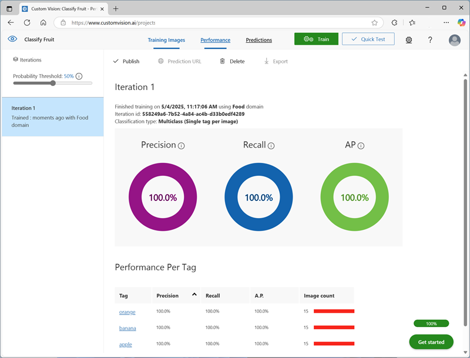

---
lab:
  title: Classificare immagini
  description: Usare il servizio Visione personalizzata di Azure AI per eseguire il training di un modello di classificazione immagini.
---

# Classificare immagini

Il servizio **Visione personalizzata di Azure AI** consente di creare modelli di visione artificiale di cui è stato eseguito il training sulle proprie immagini. È possibile usarlo per eseguire il training dei modelli di *classificazione immagini* e *rilevamento oggetti*, che è poi possibile pubblicare e utilizzare nelle applicazioni.

In questo esercizio si userà il servizio Visione personalizzata per eseguire il training di un modello di classificazione immagini in grado di identificare tre classi di frutti (mela, banana e arancia).

Anche se questo esercizio è basato su Python SDK per Visione personalizzata di Azure, è possibile sviluppare applicazioni per la visione usando più SDK specifici del linguaggio, tra cui:

* [Visione personalizzata di Azure per JavaScript (training)](https://www.npmjs.com/package/@azure/cognitiveservices-customvision-training)
* [Visione personalizzata di Azure per JavaScript (stima)](https://www.npmjs.com/package/@azure/cognitiveservices-customvision-prediction)
* [Visione personalizzata di Azure per Microsoft .NET (training)](https://www.nuget.org/packages/Microsoft.Azure.CognitiveServices.Vision.CustomVision.Training/)
* [Visione personalizzata di Azure per Microsoft .NET (stima)](https://www.nuget.org/packages/Microsoft.Azure.CognitiveServices.Vision.CustomVision.Prediction/)
* [Visione personalizzata di Azure per Java (training)](https://search.maven.org/artifact/com.azure/azure-cognitiveservices-customvision-training/1.1.0-preview.2/jar)
* [Visione personalizzata di Azure per Java (stima)](https://search.maven.org/artifact/com.azure/azure-cognitiveservices-customvision-prediction/1.1.0-preview.2/jar)

Questo esercizio richiede circa **45** minuti.

## Creare risorse di Visione personalizzata

Per poter eseguire il training di un modello, sono necessarie le risorse di Azure per il *training e* la *previsione*. È possibile creare risorse di **Visione personalizzata** per ognuna di tali attività oppure creare una singola risorsa e usarla per entrambe. In questo esercizio si creeranno risorse di **Visione personalizzata** per il training e la stima.

1. Aprire il [portale di Azure](https://portal.azure.com) all'indirizzo `https://portal.azure.com` e accedere usando le credenziali di Azure. Chiudere eventuali messaggi di benvenuto o suggerimenti visualizzati.
1. Selezionare **Crea una risorsa**.
1. Nella barra di ricerca cercare `Custom Vision`, selezionare **Visione personalizzata** e creare la risorsa con le impostazioni seguenti:
    - **Opzioni di creazione**: Entrambi
    - **Sottoscrizione**: *la sottoscrizione di Azure usata*
    - **Gruppo di risorse**: *creare o selezionare un gruppo di risorse*
    - **Area**: *scegliere una qualsiasi area disponibile*
    - **Nome**: *Un nome valido per la risorsa di Visione personalizzata*
    - **Piano tariffario per il training**: F0
    - **Piano tariffario previsione**: F0

1. Creare la risorsa e attendere il completamento della distribuzione, quindi visualizzare i relativi dettagli. Si noti che viene effettuato il provisioning di due risorse di Visione personalizzata, ovvero una per il training e un'altra per la stima.

    > **Nota**: Per ogni risorsa sono disponibili un *endpoint* e *chiavi* specifiche, che vengono usati per gestire l'accesso dal codice. Per eseguire il training di un modello di classificazione immagini, il codice deve usare la risorsa di *training* (con l'endpoint e la chiave corrispondenti). Per usare il modello con training per prevedere le classi di immagini, il codice deve usare la risorsa di *previsione* (con l'endpoint e la chiave corrispondenti).

1. Quando le risorse sono state distribuite, passare al gruppo di risorse per visualizzarle. Verranno visualizzate due risorse di Visione personalizzata, una con il suffisso ***-Prediction***.

## Creare un progetto di Visione personalizzata nel portale di Visione personalizzata

Per eseguire il training di un modello di classificazione immagini, è necessario creare un progetto Visione personalizzata basato sulla risorsa di training. A questo scopo, si userà il portale di Visione personalizzata.

1. Aprire una nuova scheda del browser, mantenendo aperta la scheda del portale di Azure, a cui si tornerà in un secondo momento.
1. Nella nuova scheda del browser aprire il [portale di Visione personalizzata](https://customvision.ai) all'indirizzo `https://customvision.ai`. Se richiesto, accedere usando le credenziali di Azure e accettare le condizioni d'uso.
1. Nel portale Visione personalizzata, creare un nuovo progetto con le impostazioni seguenti:
    - **Nome**: `Classify Fruit`
    - **Descrizione**: `Image classification for fruit`
    - **Risorsa**: *Risorsa di Visione personalizzata*
    - **Tipi di progetto**: classificazione
    - **Tipi di classificazione**: Multiclasse (un tag per immagine)
    - **Domini**: Food

### Caricare e contrassegnare le immagini

1. In una nuova scheda del browser scaricare le [immagini di training](https://github.com/MicrosoftLearning/mslearn-ai-vision/raw/main/Labfiles/image-classification/training-images.zip) da `https://github.com/MicrosoftLearning/mslearn-ai-vision/raw/main/Labfiles/image-classification/training-images.zip` ed estrarre la cartella ZIP per visualizzarne il contenuto. Questa cartella contiene sottocartelle di immagini di mele, banane e arance.
1. Nel progetto di classificazione immagini nel portale di Visione personalizzata fare clic su **Aggiungi immagini** e selezionare tutti i file disponibili nella cartella **training-images/apple** scaricata ed estratta in precedenza. Caricare quindi i file di immagine specificando il tag `apple`, come indicato di seguito:

    

1. Usare l'icona della barra degli strumenti **Aggiungi immagini** (**[+]**) per ripetere il passaggio precedente per caricare le immagini nella cartella **banana** con il tag `banana` e le immagini nella cartella **orange** con il tag `orange`.
1. Esplorare le immagini che hai caricato nel progetto Visione personalizzata. Dovrebbero essere presenti 15 immagini di ogni classe, come di seguito:

    

### Eseguire il training di un modello

1. Nel progetto di Visione personalizzata fare clic su **Esegui il training** (&#9881;<sub>&#9881;</sub>) sopra le immagini per eseguire il training di un modello di classificazione usando le immagini con tag. Selezionare l'opzione **Quick Training** (Training rapido) e quindi attendere che l'iterazione del training venga completata (potrebbe essere necessario un minuto circa).
1. Una volta che l'iterazione del modello è stata sottoposta a training, esaminare le metriche delle prestazioni *Precision* (Precisione), *Recall* (Richiamo) e *AP*, che misurano la previsione della stima del modello di classificazione e i cui valori dovrebbero essere tutti elevati.

    

> **Nota**: le metriche delle prestazioni sono basate su una soglia di probabilità del 50% per ogni previsione. In altre parole, se il modello calcola una probabilità di almeno il 50% che un'immagine appartenga a una specifica classe, viene prevista tale classe. È possibile modificare questa impostazione in alto a sinistra nella pagina.

### Test del modello

1. Sopra le metriche delle prestazioni fare clic su **Quick Test** (Test rapido).
1. Nella casella **URL immagine** digitare `https://aka.ms/test-apple` e fare clic sul pulsante dell'*immagine di test rapido (&#10132;)*.
1. Visualizzare le previsioni restituite dal modello: il punteggio di probabilità per *apple* dovrebbe essere il più alto, come di seguito:

    

1. Provare a testare le immagini seguenti:
    - `https://aka.ms/test-banana`
    - `https://aka.ms/test-orange`

1. Chiudere la finestra **Quick Test** (Test rapido).

### Visualizzare le impostazioni del progetto

Al progetto creato è stato assegnato un identificatore univoco, che sarà necessario specificare in qualsiasi codice con cui interagisce.

1. Fare clic sull'icona delle *impostazioni* (&#9881;) in alto a destra nella pagina **Prestazioni** per visualizzare le impostazioni del progetto.
1. In **Generale** (sulla sinistra) prendere nota del valore di **ID progetto** che identifica in modo univoco questo progetto.
1. A destra, in **Risorse** osservare la chiave e l'endpoint. Questi dati sono relativi alla risorsa di *training*. È anche possibile ottenere queste informazioni visualizzando la risorsa nel portale di Azure.

## Usare l'API di *training*

Il portale di Visione personalizzata offre una pratica interfaccia utente che è possibile usare per caricare e contrassegnare le immagini ed eseguire il training dei modelli. Tuttavia, in alcuni scenari può essere necessario automatizzare il training dei modelli usando l'API di training di Visione personalizzata.

### Preparare la configurazione dell'applicazione

1. Tornare alla scheda del browser contenente il portale di Azure, mantenendo aperta la scheda Portale di Visione personalizzata, a cui si tornerà in un secondo momento.
1. Nel portale di Azure usare il pulsante **[\>_]** a destra della barra di ricerca nella parte superiore della pagina per creare una nuova sessione di Cloud Shell nel portale di Azure selezionando un ambiente ***PowerShell*** senza archiviazione nella sottoscrizione.

    Cloud Shell fornisce un'interfaccia della riga di comando in un riquadro nella parte inferiore del portale di Azure.

    > **Nota**: se in precedenza è stata creata una sessione Cloud Shell che usa un ambiente *Bash*, passare a ***PowerShell***.

    > **Nota**: Se il portale chiede di selezionare una risorsa di archiviazione per salvare in modo permanente i file, scegliere **Nessun account di archiviazione richiesto**, selezionare la sottoscrizione in uso e premere **Applica**.

1. Nella barra degli strumenti di Cloud Shell scegliere **Vai alla versione classica** dal menu **Impostazioni**. Questa operazione è necessaria per usare l'editor di codice.

    **<font color="red">Verificare di passare alla versione classica di Cloud Shell prima di continuare.</font>**

1. Ridimensionare il riquadro di Cloud Shell in modo da visualizzarne una parte più ampia.

    > **Suggerimento**" È possibile ridimensionare il riquadro trascinando il bordo superiore. È anche possibile usare i pulsanti Riduci a icona e Ingrandisci per spostarsi tra Cloud Shell e l'interfaccia principale del portale.

1. Nel riquadro Cloud Shell immettere i comandi seguenti per clonare il repository GitHub contenente i file di codice per questo esercizio (digitare il comando o copiarlo negli Appunti e quindi fare clic con il pulsante destro del mouse nella riga di comando e incollarlo come testo normale):

    ```
    rm -r mslearn-ai-vision -f
    git clone https://github.com/MicrosoftLearning/mslearn-ai-vision
    ```

    > **Suggerimento**: quando si incollano i comandi in CloudShell, l'ouput può richiedere una grande quantità di buffer dello schermo. È possibile cancellare la schermata immettendo il `cls` comando per rendere più semplice concentrarsi su ogni attività.

1. Dopo aver clonato il repository, usare il comando seguente per passare ai file di codice dell'applicazione:

    ```
   cd mslearn-ai-vision/Labfiles/image-classification/python/train-classifier
   ls -a -l
    ```

    La cartella contiene i file di configurazione dell'applicazione e i file di codice per l'app. Contiene anche una sottocartella **/more-training-images** che contiene alcuni file di immagine che verranno usati per eseguire training aggiuntivo del modello.

1. Installare il pacchetto SDK per Visione personalizzata di Azure AI per il training e tutti gli altri pacchetti necessari eseguendo i comandi seguenti:

    ```
   python -m venv labenv
   ./labenv/bin/Activate.ps1
   pip install -r requirements.txt azure-cognitiveservices-vision-customvision
    ```

1. Immettere il comando seguente per modificare il file di configurazione per l'app:

    ```
   code .env
    ```

    Il file viene aperto in un editor di codice.

1. Nel file di codice aggiornare i valori di configurazione in esso contenuti in modo che corrispondano all'**Endpoint** e a una **Chiave** di autenticazione per la risorsa *training* di Visione personalizzata, quindi all'**ID progetto** per il progetto di Visione personalizzata creato in precedenza.
1. Dopo aver sostituito i segnaposto, nell'editor di codice, usare il comando **CTRL+S** per salvare le modifiche e quindi usare il comando **CTRL+Q** per chiudere l'editor di codice mantenendo aperta la riga di comando di Cloud Shell.

### Scrivere codice per eseguire il training del modello

1. Nella riga di comando di Cloud Shell immettere il comando seguente per aprire il file di codice per l'applicazione client:

    ```
   code train-classifier.py
    ```

1. Si notino i dettagli seguenti nel file di codice:
    - Gli spazi dei nomi per l'SDK di Visione personalizzata di Azure AI vengono importati.
    - La funzione **Main** recupera le impostazioni di configurazione e usa la chiave e l'endpoint per creare un
    - **CustomVisionTrainingClient** autenticato, che viene quindi usato con l'ID progetto per creare un riferimento **Project** al progetto.
    - La finzione **Upload_Images** recupera i tag definiti nel progetto Visione personalizzata e quindi carica i file di immagine dalle cartelle denominate corrispondenti al progetto, assegnando l'ID tag appropriato.
    - La funzione **Train_Model** crea una nuova iterazione di training per il progetto e attende il completamento del training.

1. Chiudere l'editor di codice (*CTRL+Q*) e immettere il comando seguente per eseguire il programma:

    ```
   python train-classifier.py
    ```

1. Attendere il completamento del programma. Tornare quindi alla scheda del browser contenente il portale di Visione personalizzata e visualizzare la pagina **Immagini di training** per il progetto. Se necessario, aggiornare il browser.
1. Verificare che alcune nuove immagini con tag siano state aggiunte al progetto. Visualizzare quindi la pagina **Prestazioni** e verificare che sia stata creata una nuova iterazione.

## Usare il classificatore di immagini in un'applicazione client

A questo punto è possibile pubblicare il modello sottoposto a training e usarlo in un'applicazione client.

### Pubblicare il modello di classificazione immagini

1. Nella pagina **Prestazioni** del portale di Visione personalizzata fare clic su **&#128504; Pubblica** per pubblicare il modello con training con le impostazioni seguenti:
    - **Nome modello**: `fruit-classifier`
    - **Risorsa stima**: *la risorsa di **stima** creata in precedenza, che termina con "-Prediction" (<u>non</u> la risorsa di training)*.
1. In alto a sinistra nella pagina **Impostazioni progetto** fare clic sull'icona *Projects Gallery* (Raccolta progetti) (&#128065;) per tornare alla pagina iniziale del portale di Visione personalizzata in cui è ora elencato il progetto appena creato.
1. In alto a destra nella pagina iniziale del portale di Visione personalizzata fare clic sull'icona delle *impostazioni* (&#9881;) per visualizzare le impostazioni del servizio Visione personalizzata. In **Risorse** individuare quindi la risorsa di *stima* che termina con "-Prediction" (<u>non</u> la risorsa di training) per determinare i relativi valori di **Chiave** ed **Endpoint**. È anche possibile ottenere queste informazioni visualizzando la risorsa nel portale di Azure.

### Usare il classificatore di immagini da un'applicazione client

1. Tornare alla scheda del browser contenente il portale di Azure e il riquadro di Cloud Shell.
1. In Cloud Shell eseguire i comandi seguenti per passare alla cartella per l'applicazione client e visualizzare i file contenuti in tale cartella:

    ```
   cd ../test-classifier
   ls -a -l
    ```

    La cartella contiene i file di configurazione dell'applicazione e i file di codice per l'app. Contiene anche una sottocartella **/test-images**, che contiene alcuni file di immagine che verranno usati per testare il modello.

1. Installare il pacchetto SDK per Visione personalizzata di Azure AI per la stima e tutti gli altri pacchetti necessari eseguendo i comandi seguenti:

    ```
   python -m venv labenv
   ./labenv/bin/Activate.ps1
   pip install -r requirements.txt azure-cognitiveservices-vision-customvision
    ```

1. Immettere il comando seguente per modificare il file di configurazione per l'app:

    ```
   code .env
    ```

    Il file viene aperto in un editor di codice.

1. Aggiornare i valori di configurazione in modo che corrispondano all'**Endpoint** e alla **Chiave** per la risorsa *<u>prediction</u>* di Visione personalizzata, all'**ID progetto** per il progetto di classificazione e al nome del modello pubblicato, che dovrebbe essere *fruit-classifier*. Salvare le modifiche (*CTRL+S*) e chiudere l'editor del codice (*CTRL+Q*).
1. Nella riga di comando di Cloud Shell immettere il comando seguente per aprire il file di codice per l'applicazione client:

    ```
   code test-classifier.py
    ```

1. Esaminare il codice, notando i dettagli seguenti:
    - Gli spazi dei nomi per l'SDK di Visione personalizzata di Azure AI vengono importati.
    - La funzione **Main** recupera le impostazioni di configurazione e usa la chiave e l'endpoint per creare un oggetto **CustomVisionPredictionClient** autenticato.
    - L'oggetto client di previsione viene usato per prevedere una classe per ogni immagine della cartella **test-images**, specificando l'ID progetto e il nome del modello per ogni richiesta. Ogni previsione include una probabilità per ogni classe possibile e vengono visualizzati solo i tag previsi con una probabilità maggiore del 50%.

1. Chiudere l'editor di codice e immettere il comando seguente per eseguire il programma:

    ```
   python test-classifier.py
    ```

    Il programma invia ognuna delle immagini seguenti al modello per la classificazione:

    

    **IMG_TEST_1.jpg**

    <br/><br/>

    

    **IMG_TEST_2.jpg**

    <br/><br/>

    

    **IMG_TEST_3.jpg**

1. Visualizzare l'etichetta (tag) e i punteggi di probabilità per ogni previsione.

## Pulire le risorse

Al termine dell'esplorazione di Visione personalizzata di Azure AI, è necessario eliminare le risorse create in questo esercizio per evitare di incorrere in costi di Azure non necessari:

1. Aprire il portale di Azure in `https://portal.azure.com` e nella barra di ricerca superiore cercare le risorse create in questo lab.

1. Nella pagina della risorsa selezionare **Elimina** e seguire le istruzioni per eliminare la risorsa. In alternativa, è possibile eliminare l'intero gruppo di risorse per pulire tutte le risorse contemporaneamente.
