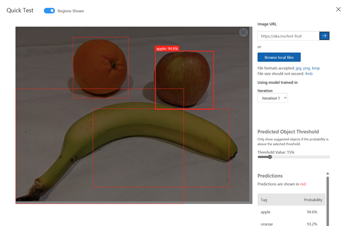

---
lab:
  title: Rilevare oggetti nelle immagini
  description: Usare il servizio Visione personalizzata di Azure AI per eseguire il training di un modello di rilevamento oggetti.
---

# Rilevare oggetti nelle immagini

Il servizio **Visione personalizzata di Azure AI** consente di creare modelli di visione artificiale di cui è stato eseguito il training sulle proprie immagini. È possibile usarlo per eseguire il training dei modelli di *classificazione immagini* e *rilevamento oggetti*, che è poi possibile pubblicare e utilizzare nelle applicazioni.

In questo esercizio si userà il servizio Visione personalizzata per eseguire il training di un modello di *rilevamento oggetti* in grado di rilevare e individuare tre classi di frutti (mela, banana e arancia) in un'immagine.

Anche se questo esercizio è basato su Python SDK per Visione personalizzata di Azure, è possibile sviluppare applicazioni per la visione usando più SDK specifici del linguaggio, tra cui:

* [Visione personalizzata di Azure per JavaScript (training)](https://www.npmjs.com/package/@azure/cognitiveservices-customvision-training)
* [Visione personalizzata di Azure per JavaScript (stima)](https://www.npmjs.com/package/@azure/cognitiveservices-customvision-prediction)
* [Visione personalizzata di Azure per Microsoft .NET (training)](https://www.nuget.org/packages/Microsoft.Azure.CognitiveServices.Vision.CustomVision.Training/)
* [Visione personalizzata di Azure per Microsoft .NET (stima)](https://www.nuget.org/packages/Microsoft.Azure.CognitiveServices.Vision.CustomVision.Prediction/)
* [Visione personalizzata di Azure per Java (training)](https://search.maven.org/artifact/com.azure/azure-cognitiveservices-customvision-training/1.1.0-preview.2/jar)
* [Visione personalizzata di Azure per Java (stima)](https://search.maven.org/artifact/com.azure/azure-cognitiveservices-customvision-prediction/1.1.0-preview.2/jar)

Questo esercizio richiede circa **45** minuti.

## Creare risorse di Visione personalizzata

Per poter eseguire il training di un modello, sono necessarie le risorse di Azure per il *training e* la *previsione*. È possibile creare risorse di **Visione personalizzata** per ognuna di tali attività oppure creare una singola risorsa e usarla per entrambe. In questo esercizio si creeranno risorse di **Visione personalizzata** per il training e la stima.

1. Aprire il [portale di Azure](https://portal.azure.com) all'indirizzo `https://portal.azure.com` e accedere usando le credenziali di Azure. Chiudere eventuali messaggi di benvenuto o suggerimenti visualizzati.
1. Selezionare **Crea una risorsa**.
1. Nella barra di ricerca cercare `Custom Vision`, selezionare **Visione personalizzata** e creare la risorsa con le impostazioni seguenti:
    - **Opzioni di creazione**: Entrambi
    - **Sottoscrizione**: *la sottoscrizione di Azure usata*
    - **Gruppo di risorse**: *creare o selezionare un gruppo di risorse*
    - **Area**: *scegliere una qualsiasi area disponibile*
    - **Nome**: *Un nome valido per la risorsa di Visione personalizzata*
    - **Piano tariffario per il training**: F0
    - **Piano tariffario previsione**: F0

1. Creare la risorsa e attendere il completamento della distribuzione, quindi visualizzare i relativi dettagli. Si noti che viene effettuato il provisioning di due risorse di Visione personalizzata, ovvero una per il training e un'altra per la stima.

    > **Nota**: Per ogni risorsa sono disponibili un *endpoint* e *chiavi* specifiche, che vengono usati per gestire l'accesso dal codice. Per eseguire il training di un modello di classificazione immagini, il codice deve usare la risorsa di *training* (con l'endpoint e la chiave corrispondenti). Per usare il modello con training per prevedere le classi di immagini, il codice deve usare la risorsa di *previsione* (con l'endpoint e la chiave corrispondenti).

1. Quando le risorse sono state distribuite, passare al gruppo di risorse per visualizzarle. Verranno visualizzate due risorse di Visione personalizzata, una con il suffisso ***-Prediction***.

## Creare un progetto di Visione personalizzata nel portale di Visione personalizzata

Per eseguire il training di un modello di rilevamento oggetti, è necessario creare un progetto Visione personalizzata basato sulla risorsa di training. A questo scopo, si userà il portale di Visione personalizzata.

1. Aprire una nuova scheda del browser, mantenendo aperta la scheda del portale di Azure, a cui si tornerà in un secondo momento.
1. Nella nuova scheda del browser aprire il [portale di Visione personalizzata](https://customvision.ai) all'indirizzo `https://customvision.ai`. Se richiesto, accedere usando le credenziali di Azure e accettare le condizioni d'uso.
1. Creare un nuovo progetto con le seguenti impostazioni:
    - **Nome**: `Detect Fruit`
    - **Descrizione**: `Object detection for fruit.`
    - **Risorsa**: *Risorsa di Visione personalizzata*
    - **Tipi di progetto**: Rilevamento oggetti
    - **Domini**: Generale
1. Attendere che il progetto venga creato e aperto nel browser.

## Caricare e contrassegnare le immagini

Ora che si dispone di un progetto di rilevamento oggetti, è possibile caricare e contrassegnare le immagini per eseguire il training di un modello.

### Caricare e contrassegnare le immagini nel portale di Visione personalizzata

Il portale di Visione personalizzata include strumenti visivi che è possibile usare per caricare immagini e contrassegnare le aree al loro interno che contengono più tipi di oggetti.

1. In una nuova scheda del browser scaricare le [immagini di training](https://github.com/MicrosoftLearning/mslearn-ai-vision/raw/main/Labfiles/object-detection/training-images.zip) da `https://github.com/MicrosoftLearning/mslearn-ai-vision/raw/main/Labfiles/object-detection/training-images.zip` ed estrarre la cartella ZIP per visualizzarne il contenuto. Questa cartella contiene immagini di frutta.
1. Nel portale Visione personalizzata, nel tuo progetto di rilevamento degli oggetti, seleziona **Aggiungi immagini** e carica tutte le immagini della cartella estratta.
1. Dopo aver caricato le immagini, selezionare la prima per aprirla.
1. Posizionare il mouse su qualsiasi oggetto nell'immagine fino a quando viene visualizzata un'area rilevata automaticamente come nell'immagine seguente. Quindi selezionare l'oggetto e, se necessario, ridimensionare l'area per circondarlo.

    

    In alternativa, è possibile trascinare semplicemente il mouse intorno all'oggetto per creare un'area.

1. Quando l'area circonda l'oggetto, aggiungere un nuovo tag con il tipo di oggetto appropriato (*apple*, *banana* o *orange*) come mostrato di seguito:

    

1. Selezionare ogni altro oggetto nell'immagine e aggiungere i tag, ridimensionando le aree e aggiungendo nuovi tag come necessario.

    

1. Usare il collegamento **>** sulla destra per passare all'immagine successiva e aggiungere un tag ai relativi oggetti. Continuare così per tutta la raccolta di immagini, aggiungendo un tag a ogni mela, banana e arancia.

1. Al termine dell'assegnazione di tag all'ultima immagine, chiudere l'editor **Dettaglio immagine**. Nella pagina **Immagini di training**, in **Tag** selezionare **Contrassegnate** per visualizzare tutte le immagini con tag:


### Usare l'SDK di Visione personalizzata per caricare le immagini

È possibile usare l'interfaccia utente nel portale di Visione personalizzata per assegnare un tag alle immagini, ma molti team di sviluppo per intelligenza artificiale usano altri strumenti che generano file contenenti informazioni sui tag e sulle aree oggetto nelle immagini. In scenari come questo è possibile usare l'API Training di Visione personalizzata per caricare immagini con tag nel progetto.

1. Fare clic sull'icona delle *impostazioni* (&#9881;) in alto a destra nella pagina **Immagini training** nel portale di Visione personalizzata per visualizzare le impostazioni del progetto.
1. In **Generale** (sulla sinistra) prendere nota del valore di **ID progetto** che identifica in modo univoco questo progetto.
1. A destra, in **Risorse** osservare la **Chiave** e l'**Endpoint**. Questi dati sono relativi alla risorsa di *training*. È anche possibile ottenere queste informazioni visualizzando la risorsa nel portale di Azure.
1. Tornare alla scheda del browser contenente il portale di Azure, mantenendo aperta la scheda Portale di Visione personalizzata, a cui si tornerà in un secondo momento.
1. Nel portale di Azure usare il pulsante **[\>_]** a destra della barra di ricerca nella parte superiore della pagina per creare una nuova sessione di Cloud Shell nel portale di Azure selezionando un ambiente ***PowerShell*** senza archiviazione nella sottoscrizione.

    Cloud Shell fornisce un'interfaccia della riga di comando in un riquadro nella parte inferiore del portale di Azure.

    > **Nota**: se in precedenza è stata creata una sessione Cloud Shell che usa un ambiente *Bash*, passare a ***PowerShell***.

    > **Nota**: Se il portale chiede di selezionare una risorsa di archiviazione per salvare in modo permanente i file, scegliere **Nessun account di archiviazione richiesto**, selezionare la sottoscrizione in uso e premere **Applica**.

1. Nella barra degli strumenti di Cloud Shell scegliere **Vai alla versione classica** dal menu **Impostazioni**. Questa operazione è necessaria per usare l'editor di codice.

    **<font color="red">Verificare di passare alla versione classica di Cloud Shell prima di continuare.</font>**

1. Ridimensionare il riquadro di Cloud Shell in modo da visualizzarne una parte più ampia.

    > **Suggerimento**" È possibile ridimensionare il riquadro trascinando il bordo superiore. È anche possibile usare i pulsanti Riduci a icona e Ingrandisci per spostarsi tra Cloud Shell e l'interfaccia principale del portale.

1. Nel riquadro Cloud Shell immettere i comandi seguenti per clonare il repository GitHub contenente i file di codice per questo esercizio (digitare il comando o copiarlo negli Appunti e quindi fare clic con il pulsante destro del mouse nella riga di comando e incollarlo come testo normale):

    ```
    rm -r mslearn-ai-vision -f
    git clone https://github.com/MicrosoftLearning/mslearn-ai-vision
    ```

    > **Suggerimento**: quando si incollano i comandi in CloudShell, l'ouput può richiedere una grande quantità di buffer dello schermo. È possibile cancellare la schermata immettendo il `cls` comando per rendere più semplice concentrarsi su ogni attività.

1. Dopo aver clonato il repository, usare il comando seguente per passare ai file di codice dell'applicazione:

    ```
   cd mslearn-ai-vision/Labfiles/object-detection/python/train-detector
   ls -a -l
    ```

    La cartella contiene i file di configurazione dell'applicazione e i file di codice per l'app. Contiene anche un file **tagged-images.json** che contiene le coordinate del rettangolo delimitatore per gli oggetti in più immagini e una sottocartella **/images**, che contiene le immagini.

1. Installare il pacchetto SDK per Visione personalizzata di Azure AI per il training e tutti gli altri pacchetti necessari eseguendo i comandi seguenti:

    ```
   python -m venv labenv
   ./labenv/bin/Activate.ps1
   pip install -r requirements.txt azure-cognitiveservices-vision-customvision
    ```

1. Immettere il comando seguente per modificare il file di configurazione per l'app:

    ```
   code .env
    ```

    Il file viene aperto in un editor di codice.

1. Nel file di codice aggiornare i valori di configurazione in esso contenuti in modo che corrispondano all'**Endpoint** e a una **Chiave** di autenticazione per la risorsa *training* di Visione personalizzata, quindi all'**ID progetto** per il progetto di Visione personalizzata creato in precedenza.
1. Dopo aver sostituito i segnaposto, nell'editor di codice, usare il comando **CTRL+S** per salvare le modifiche e quindi usare il comando **CTRL+Q** per chiudere l'editor di codice mantenendo aperta la riga di comando di Cloud Shell.
1. Nella riga di comando di Cloud Shell immettere il comando seguente per aprire il file **tagged-images.json** per visualizzare le informazioni sull'assegnazione di tag per i file di immagine nella sottocartella **/images**:

    ```
   code tagged-images.json
    ```
    
     Il codice JSON definisce un elenco di immagini, ognuna delle quali contiene una o più aree con tag. Ogni area con tag include un nome di tag e le coordinate top e left, nonché le dimensioni di larghezza e altezza del rettangolo delimitatore contenente l'oggetto con tag.

    > **Nota**: le coordinate e le dimensioni in questo file indicano punti relativi nell'immagine. Ad esempio, un valore *height* pari a 0.7 si riferisce a un rettangolo delimitatore che rappresenta il 70% dell'altezza dell'immagine. Con alcuni strumenti per l'assegnazione di tag vengono generati altri formati di file in cui i valori di coordinate e dimensioni rappresentano pixel, pollici o altre unità di misura.

1. Chiudere il file JSON senza salvare modifiche (*CTRL_Q*).

1. Nella riga di comando di Cloud Shell immettere il comando seguente per aprire il file di codice per l'applicazione client:

    ```
   code add-tagged-images.py
    ```

1. Si notino i dettagli seguenti nel file di codice:
    - Gli spazi dei nomi per l'SDK di Visione personalizzata di Azure AI vengono importati.
    - La funzione **Main** recupera le impostazioni di configurazione e usa la chiave e l'endpoint per creare un oggetto **CustomVisionTrainingClient** autenticato, che viene quindi usato con l'ID progetto per creare un riferimento **Project** al progetto.
    - La funzione **Upload_Images** estrae le informazioni sull'area contrassegnata dal file JSON e le usa per creare un batch di immagini con aree, che viene quindi caricato nel progetto.

1. Chiudere l'editor di codice (*CTRL+Q*) e immettere il comando seguente per eseguire il programma:

    ```
   python add-tagged-images.py
    ```

1. Attendere il completamento del programma.
1. Tornare alla scheda del browser contenente il portale di Visione personalizzata (mantenendo aperta la scheda Cloud Shell del portale di Azure) e visualizzare la pagina **Immagini training** per il progetto (se necessario aggiornare il browser).
1. Verificare che alcune nuove immagini con tag siano state aggiunte al progetto.

## Eseguire il training e testare un modello

Dopo aver contrassegnato le immagini nel progetto, è possibile eseguire il training di un modello.

1. Nel progetto Visione personalizzata, fare clic su **Eseguire il training** (&#9881;<sub>&#9881;</sub>) per eseguire il training di un modello di rilevamento oggetti usando le immagini con tag. Selezionare l'opzione **Quick Training** (Training rapido).
1. Attendere il completamento del training (potrebbero essere necessari all'incirca dieci minuti).

    > **Suggerimento**: Azure Cloud Shell ha un timeout di inattività di 20 minuti, dopodiché la sessione viene abbandonata. Mentre si attende il completamento del training, tornare occasionalmente in Cloud Shell e immettere un comando come `ls` per mantenere attiva la sessione.

1. Al termine del training, nel portale di Visione personalizzata esaminare le metriche delle prestazioni *Precisione*, *Richiamo* e *mAP*: queste metriche misurano l'accuratezza della previsione del modello di rilevamento oggetti e devono essere tutte elevate.
1. Nella parte superiore destra della pagina fare clic su **Test rapido**, quindi nella casella **URL immagine** digitare `https://aka.ms/test-fruit` e fare clic sul pulsante *immagine di test rapido* (&#10132;).
1. Visualizzare la previsione generata.

    

1. Chiudere la finestra **Quick Test** (Test rapido).

## Usare il rilevatore di oggetti in un'applicazione client

A questo punto è possibile pubblicare il modello sottoposto a training e usarlo in un'applicazione client.

### Pubblicare il modello di rilevamento oggetti

1. Nella pagina **Prestazioni** del portale di Visione personalizzata fare clic su **&#128504; Pubblica** per pubblicare il modello con training con le impostazioni seguenti:
    - **Nome modello**: `fruit-detector`
    - **Risorsa stima**: *la risorsa di **stima** creata in precedenza, che termina con "-Prediction" (<u>non</u> la risorsa di training)*.
1. In alto a sinistra nella pagina **Impostazioni progetto** fare clic sull'icona *Projects Gallery* (Raccolta progetti) (&#128065;) per tornare alla pagina iniziale del portale di Visione personalizzata in cui è ora elencato il progetto appena creato.
1. In alto a destra nella pagina iniziale del portale di Visione personalizzata fare clic sull'icona delle *impostazioni* (&#9881;) per visualizzare le impostazioni del servizio Visione personalizzata. In **Risorse** individuare quindi la risorsa di *stima* che termina con "-Prediction" (<u>non</u> la risorsa di training) per determinare i relativi valori di **Chiave** ed **Endpoint**. È anche possibile ottenere queste informazioni visualizzando la risorsa nel portale di Azure.

## Usare il classificatore di immagini da un'applicazione client

A questo punto, dopo aver pubblicato il modello di classificazione immagini, è possibile usarlo da un'applicazione client. Anche questa volta, è possibile scegliere di usare **C#** o **Python**.

1. Tornare alla scheda del browser contenente il portale di Azure e il riquadro di Cloud Shell.
1. In Cloud Shell eseguire i comandi seguenti per passare alla cartella per l'applicazione client e visualizzare i file contenuti in tale cartella:

    ```
   cd ../test-detector
   ls -a -l
    ```

    La cartella contiene i file di configurazione dell'applicazione e i file di codice per l'app. Contiene anche il file di immagine **produce.jpg** seguente, che verrà usato per testare il modello.

    

1. Installare il pacchetto SDK per Visione personalizzata di Azure AI per la stima e tutti gli altri pacchetti necessari eseguendo i comandi seguenti:

    ```
   python -m venv labenv
   ./labenv/bin/Activate.ps1
   pip install -r requirements.txt azure-cognitiveservices-vision-customvision
    ```

1. Immettere il comando seguente per modificare il file di configurazione per l'app:

    ```
   code .env
    ```

    Il file viene aperto in un editor di codice.

1. Aggiornare i valori di configurazione in modo che corrispondano all'**Endpoint** e alla **Chiave** per la risorsa *<u>prediction</u>* di Visione personalizzata, all'**ID progetto** per il progetto di rilevamento oggetti e al nome del modello pubblicato, che dovrebbe essere *fruit-detector*. Salvare le modifiche (*CTRL+S*) e chiudere l'editor del codice (*CTRL+Q*).

1. Nella riga di comando di Cloud Shell immettere il comando seguente per aprire il file di codice per l'applicazione client:

    ```
   code test-detector.py
    ```

1. Esaminare il codice, notando i dettagli seguenti:
    - Gli spazi dei nomi per l'SDK di Visione personalizzata di Azure AI vengono importati.
    - La funzione **Main** recupera le impostazioni di configurazione e usa la chiave e l'endpoint per creare un oggetto **CustomVisionPredictionClient** autenticato.
    - L'oggetto client di previsione viene usato per ottenere le previsioni di rilevamento oggetti per l'immagine **produce.jpg**, specificando l'ID progetto e il nome del modello nella richiesta. Le aree con tag stimate vengono quindi disegnate nell'immagine e il risultato viene salvato come **output.jpg**.
1. Chiudere l'editor di codice e immettere il comando seguente per eseguire il programma:

    ```
   python test-detector.py
    ```

1. Esaminare l'output del programma, che elenca ogni oggetto rilevato nell'immagine.
1. Si noti che viene generato un file di immagine denominato **output.jpg**. Usare il comando **download** (specifico di Azure Cloud Shell) per scaricarlo:

    ```
   download output.jpg
    ```

    Il comando download crea un collegamento popup in basso a destra del browser, che è possibile selezionare per scaricare e aprire il file. L'immagine dovrebbe essere simile alla seguente:

    

## Pulire le risorse

Se non si usano le risorse di Azure create in questo lab per altri moduli di training, è possibile eliminarle per evitare addebiti aggiuntivi.

1. Aprire il portale di Azure in `https://portal.azure.com` e nella barra di ricerca superiore cercare le risorse create in questo lab.

1. Nella pagina della risorsa selezionare **Elimina** e seguire le istruzioni per eliminare la risorsa. In alternativa, è possibile eliminare l'intero gruppo di risorse per pulire tutte le risorse contemporaneamente.
   
## Ulteriori informazioni

Per altre informazioni sul rilevamento oggetti con il servizio Visione personalizzata, vedere la [documentazione di Visione personalizzata](https://docs.microsoft.com/azure/cognitive-services/custom-vision-service/).
